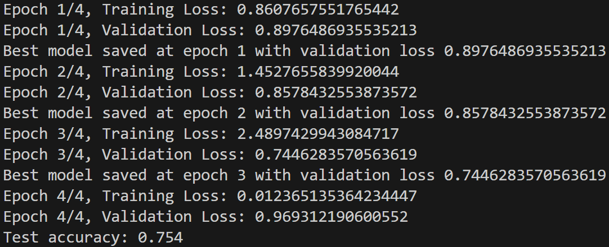

## CNN report of task2

### 1. 模型结构

#### 1.1 输入层

- **最大序列长度 (`max_len`)**：16
- **词嵌入层 (`embedding`)**：
  - **词汇表大小 (`vocab_size`)**：58559
  - **嵌入维度 (`embed_size`)**：256

#### 1.2 卷积层 (`convs`)

- **卷积核数量 (`num_filters`)**：32
- **卷积核大小 (`filter_sizes`)**：[2, 2, 2, 3, 3, 3, 4, 4, 5, 6]
  - 使用了10个不同大小的卷积核，每个卷积核大小分别为2、2、2、3、3、3、4、4、5、6。

#### 1.3 池化层 (`poolings`)

- **最大池化层 (`MaxPool2d`)**：
  - 每个卷积核对应一个最大池化层，池化窗口大小为 `(max_len - fs + 1, 1)`，其中 `fs` 是卷积核的大小。

#### 1.4 全连接层 (`fc`)

- **输入维度**：`num_filters * len(filter_sizes)`，即 `32 * 10 = 320`
- **隐藏层大小 (`hidden_size`)**：64

#### 1.5 激活函数 (`relu`)

- **ReLU**：用于激活隐藏层的输出。

#### 1.6 Dropout层 (`dropout`)

- **Dropout率 (`dropout`)**：0.5

#### 1.7 输出层 (`output`)

- **输入维度**：`hidden_size`，即 64
- **输出类别数 (`num_classes`)**：4

### 2. 训练配置

#### 2.1 训练轮数 (`epoch_num`)

- **训练轮数**：4
- 注：在第三轮早停

#### 2.2 批量大小 (`batch_size`)

- **批量大小**：4

### 3. 准确度

- **准确度**：75.4%

