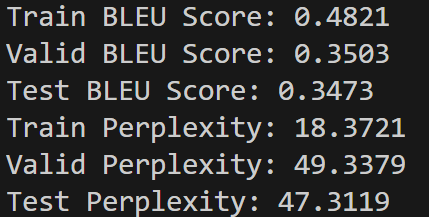
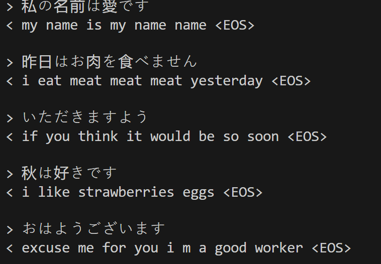
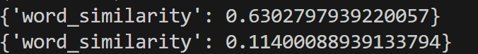

# Task3 report

## RNN configuration

RNN 模型配置是一个基于 **LSTM（Long Short-Term Memory）** 的编码器-解码器架构，并且我使用了 **Bahdanau Attention** 机制来增强解码器的性能。

---

### 1. **EncoderLSTM 类**

这个类实现了模型中的 **编码器（Encoder）**，负责将输入序列转换为一组上下文表示（上下文向量）。

#### 模型参数：

- **input_embedding**：预训练的嵌入矩阵作为输入的嵌入层，`nn.Embedding.from_pretrained` 用于加载预训练的嵌入。这层的参数被冻结（`freeze=True`），意味着嵌入不会在训练中更新。
- **hidden_size**：LSTM 的隐藏层大小，也就是 LSTM 单元的输出向量的维度。在我的模型中，这个值为 `256`。
- **dropout_p**：Dropout 概率，用于防止过拟合。我设置的默认值是 `0.1`。

#### 结构与运算步骤：

1. **Embedding 层**：
   - 使用预训练的嵌入矩阵，将输入的索引序列转化为嵌入向量。
   
2. **LayerNorm 层**：
   - 对嵌入后的序列进行 Layer Normalization，以消除特征维度上的均值和方差的差异，增强训练稳定性。

3. **LSTM 层**：
   - 这里使用了双层 LSTM，输入是处理后的嵌入向量，输出是编码器的输出（`output`）和最后的隐藏状态（`hidden`）及细胞状态（`cell`）。

#### 代码片段：

```python
class EncoderLSTM(nn.Module):
    def __init__(self, input_embedding, hidden_size, dropout_p=0.1):
        super(EncoderLSTM, self).__init__()
        self.hidden_size = hidden_size
        self.embedding = nn.Embedding.from_pretrained(input_embedding, freeze=True)
        self.lstm = nn.LSTM(hidden_size, hidden_size, batch_first=True)
        self.layernorm = nn.LayerNorm(hidden_size)
        self.dropout = nn.Dropout(dropout_p)

    def forward(self, input):
        embedded = self.dropout(self.embedding(input))
        embedded = self.layernorm(embedded)
        output, (hidden, cell) = self.lstm(embedded)
        return output, (hidden, cell)
```

---

### 2. **AttnDecoderLSTM 类**

这个类实现了 **解码器（Decoder）**，通过使用 Bahdanau Attention 机制来处理编码器的输出，并生成目标序列。

#### 模型参数：

- **hidden_size**：LSTM 的隐藏状态大小，与编码器的隐藏大小保持一致，即 `256`。
- **output_size**：输出词汇表的大小，用于生成模型的最终输出。
- **output_embedding**：与输入嵌入类似，解码器使用了预训练的嵌入矩阵，且被冻结。
- **dropout_p**：Dropout 概率，这里默认设定为 `0.1`。

#### 结构与运算步骤：

1. **Embedding 层**：
   - 使用预训练的嵌入矩阵，将目标序列（或解码器的输入）转化为嵌入向量。

2. **Bahdanau Attention 机制**：
   - 通过注意力机制，将解码器隐藏状态作为查询（query），编码器的输出作为键（key）和值（value），计算上下文向量（context vector）。Bahdanau Attention 可以看作一种 "soft search" 机制，它根据解码器的当前状态来选择编码器的输出中哪些信息最重要。

3. **LSTM 层**：
   - LSTM 接收解码器当前的输入和上下文向量，生成新的隐藏状态和细胞状态。

4. **LayerNorm 层**：
   - 对 LSTM 的输出进行归一化，确保数据的稳定性。

5. **输出层**：
   - 使用全连接层将解码器的输出映射到目标词汇表的大小，并通过 `log_softmax` 计算词的概率分布。

#### 代码片段：

```python
class AttnDecoderLSTM(nn.Module):
    def __init__(self, hidden_size, output_size, output_embedding, dropout_p=0.1):
        super().__init__()
        self.embedding = nn.Embedding.from_pretrained(output_embedding, freeze=True)
        self.attention = BahdanauAttention(hidden_size)
        self.lstm = nn.LSTM(hidden_size * 2, hidden_size, batch_first=True)
        self.layernorm = nn.LayerNorm(hidden_size)
        self.out = nn.Linear(hidden_size, output_size)
        self.dropout = nn.Dropout(dropout_p)

    def forward(self, encoder_outputs, encoder_hidden, target_tensor=None):
        batch_size = encoder_outputs.size(0)
        decoder_input = torch.empty(batch_size, 1, dtype=torch.long, device=device).fill_(SOS_token)
        (decoder_hidden, decoder_cell) = encoder_hidden
        decoder_outputs = []
        attentions = []

        for i in range(MAX_LENGTH):
            decoder_output, (decoder_hidden, decoder_cell), attn_weights = self.forward_step(
                decoder_input, (decoder_hidden, decoder_cell), encoder_outputs)
            decoder_outputs.append(decoder_output)
            attentions.append(attn_weights)

            if target_tensor is not None:
                decoder_input = target_tensor[:, i].unsqueeze(1)  # Teacher forcing
            else:
                _, topi = decoder_output.topk(1)
                decoder_input = topi.squeeze(-1).detach()  # detach from history as input

        decoder_outputs = torch.cat(decoder_outputs, dim=1)
        decoder_outputs = F.log_softmax(decoder_outputs, dim=-1)
        attentions = torch.cat(attentions, dim=1)
        
        return decoder_outputs, (decoder_hidden, decoder_cell), attentions

    def forward_step(self, input, hidden, encoder_outputs):
        embedded = self.dropout(self.embedding(input))

        query = torch.tensor(hidden[0]).permute(1, 0, 2)  # Use hidden state from LSTM
        context, attn_weights = self.attention(query, encoder_outputs)
        input_lstm = torch.cat((embedded, context), dim=2)

        output, (hidden, cell) = self.lstm(input_lstm, hidden)
        output = self.layernorm(output)
        output = self.out(output)

        return output, (hidden, cell), attn_weights
```

---

### 3. **Attention 机制：Bahdanau Attention**

**Bahdanau Attention（加性注意力）** 是一种早期的注意力机制，用于解码器中帮助模型选择编码器的输出中最相关的部分。具体来说，它通过计算解码器的当前隐藏状态与编码器的输出之间的相似度分数，来生成一个上下文向量。


---

### 4. **训练超参数**

- **hidden_size = 256**：LSTM 的隐藏状态大小设为 256，表示每个 LSTM 单元输出 256 维的向量。
- **learning_rate = 0.0009**：学习率设为 0.0009，控制参数更新的步长。
- **n_epochs = 6**：模型训练的轮次设为 6，即模型将在整个数据集上迭代 6 次。
- **dropout_p = 0.4**：Dropout 的概率设为 0.4，意味着在训练过程中，40% 的神经元将被随机丢弃。

---

### 5. **总结**

我的模型是一个典型的 **Encoder-Decoder** 结构，使用了 **LSTM** 作为编码器和解码器的核心单元，并且在解码器中集成了 **Bahdanau Attention** 机制，用以提升模型的对齐能力，使得解码器能够更好地选择编码器输出中的相关部分。模型的嵌入层利用了预训练的词向量，并通过 **LayerNorm** 和 **Dropout** 来增强模型的训练稳定性和泛化能力。

## 实验结果

### BLEU Score and Perplexity



### 5个例子的翻译结果



## 分析

### 改进

我的模型是在作业页面提供的参考网页中基本的 **Encoder-Decoder** 结构上进行了改进，主要体现在以下几个方面：

1. 使用LSTM代替了GRU
2. 引入了Bahdanau Attention机制
3. 使用了预训练的词向量
4. 使用了LayerNorm来增强模型的稳定性
5. 引入了PAD token，使得模型不会混淆SOS与PAD，训练效果更好
6. 使用了lr_scheduler，使得学习率能够动态调整

### 局限性

1. 数据集大小有限，模型的泛化能力受到限制
2. 没有在训练过程中减小PAD token的影响，使得模型在生成时可能会出现过多的PAD token
3. 最终的模型仍然存在一定的过拟合风险，训练loss过低，验证loss过高

### 可能的改进方向

1. 使用更大的数据集进行训练，提升模型的泛化能力
2. 在训练过程中使用pad_packed_sequence, pack_padded_sequence
3. 尝试其他的注意力机制，如 Transformer Attention

### 一些发现和说明

1. 在训练过程中，模型的BLEU Score和Perplexity并不总是正相关的，有时候BLEU Score较高，但Perplexity较高，这可能是因为BLEU Score更多地关注了模型生成的结果，而Perplexity更多地关注了模型的预测准确性。
2. 由于数据集中短句较多，我调整了bleu score的计算方式，权重改为[0.5, 0.5, 0, 0]
3. word2vec训练的词向量效果并不是很好，可能是因为数据集较小，词向量的表达能力有限，日语词向量效果更好一些

4. 我的validloss总是卡在1.3左右，可能是因为模型过拟合了，但是我尝试了dropout和weight_decay，效果并不是很好
